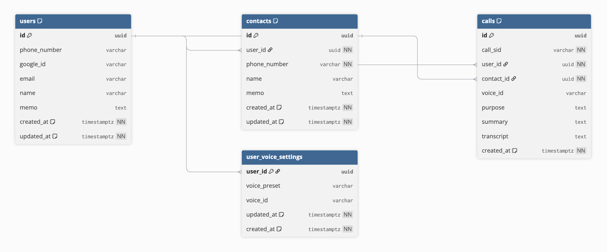

# CallBa

콜포비아 사용자를 위한 **전화 발신 보조 웹 서비스**

## 프로젝트 개요

전화 통화에 대한 불안으로 발신이 부담스러운 사용자를 위해  
사용자 입력 기반의 통화 목적을 음성(TTS)으로 대신 전달하고,  
실시간 자막 및 상황별 응답 추천으로 통화 전반을 지원합니다.

## 팀 & 역할

팀명: Legend  
기간: 2025.09.04 – 2025.12.18

|        | 하서경 | 김나림 | 윤예진 | 임은서 |
| ------ | :--: | :--: | :--: | :--: |
| 프로필 |  |  |  |  |
| 역할 | 팀장 | 팀원 | 팀원 | 팀원 |
| 담당 | Backend 개발<br/>Twilio 통화 제어<br/>STT/TTS 연동 | Backend 개발<br/>LLM 기반 통화 내용 요약 | UI/Frontend 개발<br/>DB 설계 및 연동<br/>로그인/인증 구현 | UI/Frontend 개발<br/>발표 및 시연 |

## 기술 스택

### Frontend

-   HTML, CSS, Vanilla JavaScript
-   Socket.IO Client

### Backend

-   Node.js / Express
-   WebSocket (Twilio Media Stream)
-   Socket.IO

### Voice / AI

-   Twilio (Call, TwiML, Media Stream)
-   Azure Speech-to-Text (Streaming)
-   Gemini (대화 추천 멘트, 통화 요약)
-   ElevenLabs (TTS)

### Database / Infra

-   PostgreSQL
-   Prisma ORM
-   Docker / Docker Compose
-   ngrok

## 핵심 기능

### 전화 발신 및 통화 흐름 제어

-   웹에서 발신 요청 시 Twilio Call API로 전화 연결
-   TwiML을 통해 통화 시작, 대기, 음성 재생 등 통화 흐름 제어
-   통화 상태 콜백을 수신해 실시간 상태 동기화

### 실시간 음성 인식 및 자막 제공

-   Twilio Media Stream을 WebSocket으로 수신
-   μ-law 음성을 PCM으로 변환 후 Azure STT로 실시간 음성 인식
-   인식 결과를 자막 형태로 프론트에 실시간 전달

### AI 기반 대화 지원

-   STT 결과를 기반으로 Gemini가 상황별 추천 답변 생성
-   추천 멘트를 프론트에 실시간 제공하여 전화 응대 보조

### TTS 생성 및 재생

-   추천 멘트 또는 사용자 입력 문장을 ElevenLabs TTS로 음성 생성
-   생성된 음성을 통화 중 실시간 재생하거나 웹에서 미리듣기 지원

### 통화 요약 및 기록 관리

-   통화 종료 시 전체 대화를 Gemini로 요약
-   요약 및 대화 기록을 DB에 저장하고 조회 가능

## 실시간 음성 처리 아키텍처

1. 웹에서 전화 발신 요청
2. Twilio가 전화를 연결하고 Media Stream으로 음성 송출
3. 서버가 음성을 WebSocket으로 수신 후 STT 수행
4. 인식된 텍스트로 추천 멘트 생성 및 실시간 전달
5. 선택된 멘트를 TTS로 생성해 통화 중 재생
6. 통화 종료 후 요약 생성 및 저장

> 파이프라인 요약:  
> Twilio Media Stream → WebSocket → Azure STT → Gemini → Socket.IO → (ElevenLabs TTS)

## ERD
<p align="left">
  
</p>

## 프로젝트 구조
<details open>
<summary><strong>전체 디렉터리 구조</strong></summary>

```bash
front/                  # Node(Express) 서버 + 정적 프론트(바닐라 JS) 통합 디렉터리
├─ public/              # 프론트 정적 리소스(HTML/CSS/JS)
├─ src/                 # 서버 핵심 로직
│  ├─ routes/           # HTTP API 라우트(auth/user/call/twilio)
│  ├─ sockets/          # 실시간 처리(WebSocket: Media Stream, Socket.IO)
│  ├─ services/         # 외부 연동 로직(Twilio, ElevenLabs, Gemini 등)
│  ├─ config/           # 환경변수 및 외부 클라이언트 초기화
│  ├─ auth/             # Google OAuth 설정
│  ├─ db/               # Prisma 클라이언트
│  └─ utils/            # 오디오 유틸(μ-law→PCM 변환 등)
├─ audio/               # TTS로 생성된 mp3 파일 정적 서빙
├─ prisma/              # Prisma 스키마/마이그레이션
├─ server.js            # 서버 엔트리
├─ docker-compose.yml   # 로컬 Postgres 실행
└─ .env.example         # 환경변수 템플릿
```
</details>

<details open>
<summary><strong>디렉터리 구조 상세</strong></summary>

```bash
front/
    audio/                        # TTS로 생성된 오디오(mp3) 정적 서빙 디렉터리
    node_modules/                 # 의존성
    prisma/                       # Prisma schema 및 migration 관리
    public/                       # 프론트 정적 리소스
        css/                      # 공통 스타일
        javascript/               # 브라우저 스크립트
        pages/                    # HTML 페이지
    src/                          # 서버 핵심 로직
        auth/
            passport.js           # Google OAuth 전략/세션 설정
        config/
            env.js                # 환경변수 로딩, 외부 API 클라이언트 초기화
            voice.js              # 음성 프리셋 매핑/관리
        db/
            prisma.js             # Prisma Client 초기화 및 DB 연결
        routes/
            authRoutes.js         # 로그인, 콜백, 로그아웃 등
            callRoutes.js         # 통화 생성, 상태 관리, 미리듣기
            twilioRoutes.js       # TwiML 응답 및 Twilio 콜백
            userRoutes.js         # 프로필 조회, 보이스 설정
        services/
            ttsService.js         # ElevenLabs TTS 호출, 오디오 파일 생성/저장
            twilioService.js      # Twilio Call 생성/업데이트/제어
            summaryService.js     # 통화 요약 (Gemini)
        sockets/
            mediaSocket.js        # Twilio Media Stream WebSocket 수신 → STT(Azure) → 추천(Gemini) 파이프라인
            frontendSocket.js     # 프론트로 실시간 이벤트 Push(자막/추천멘트/통화 상태)
        utils/
            audio.js              # 오디오 파일 경로/입출력 유틸
            mulaw.js              # 오디오 전처리: μ-law → PCM 변환
    .env
    .env.example                  # 환경변수 템플릿
    .gitignore
    docker-compose.yml            # 로컬 Postgres 실행 설정
    package-lock.json
    prisma.config.ts
    README.md
    server.js                     # 서버 엔트리: Express 설정 + 라우트/소켓 초기화
```
</details>


## 실행 방법

### 1️⃣ 사전 준비

-   Node.js (권장: LTS)
-   Docker / Docker Compose
-   ngrok
-   계정 및 API Key: Twilio, Azure STT, ElevenLabs, Gemini API

### 2️⃣ 환경변수 설정

프로젝트 루트(`front/`)에 `.env` 파일을 생성하고 아래 값을 설정합니다.  
필수 값은 `.env.example` 파일을 참고하세요.

<details>
<summary><b>환경변수 목록 보기</b></summary>

<br />

```bash
# Server
PORT=3003
PUBLIC_HOST=
SERVER_URL=

# Twilio
TWILIO_ACCOUNT_SID=
TWILIO_AUTH_TOKEN=
TWILIO_API_KEY=
TWILIO_API_SECRET=
TWILIO_TWIML_APP_SID=
TWILIO_FROM_NUMBER=
TWILIO_CALLER_ID=
TWILIO_MEDIA_STREAM_URL=    # (선택) 기본적으로 PUBLIC_HOST 기반 동작

# STT / LLM
AZURE_SPEECH_KEY=
AZURE_SPEECH_REGION=
GEMINI_API_KEY=

# ElevenLabs
ELEVENLABS_API_KEY=
ELEVENLABS_MODEL_ID=
ELEVENLABS_VOICE_ID=

# ElevenLabs Voice Presets
ELEVENLABS_VOICE_ID_BRIGHT=
ELEVENLABS_VOICE_ID_CLEAR=
ELEVENLABS_VOICE_ID_CALM=
ELEVENLABS_VOICE_ID_WARM=

# Database
DATABASE_URL=
POSTGRES_USER=
POSTGRES_PASSWORD=
POSTGRES_DB=
POSTGRES_PORT=
POSTGRES_HOST=

# Auth
GOOGLE_CLIENT_ID=
GOOGLE_CLIENT_SECRET=
GOOGLE_CALLBACK_URL=
SESSION_SECRET=
```

</details>

### 3️⃣ 서버 실행

```bash
npm install
docker-compose up -d   # Postgres 실행
node server.js         # 서버 실행
```

### 4️⃣ 외부 접근 설정 (ngrok)

Twilio Webhook 및 Media Stream 연결을 위해 ngrok으로 서버를 외부에 노출합니다.
ngrok에서 발급된 URL을 PUBLIC_HOST 환경변수에 설정합니다.

```bash
ngrok http 3003
```

## 주요 엔드포인트

| 구분   | Method | Path             | 설명                                           |
| ------ | ------ | ---------------- | ---------------------------------------------- |
| Client | POST   | `/calls`         | 전화 발신 요청 (시작 멘트 생성 후 Twilio 발신) |
| Client | GET    | `/calls/history` | 통화 기록 조회                                 |
| Client | POST   | `/tts-preview`   | TTS 미리듣기                                   |
| Twilio | POST   | `/call-status`   | 통화 상태 콜백                                 |
| Twilio | ALL    | `/twilio/answer` | TwiML 응답 (스트림 시작 + 시작 멘트 재생)      |
| Twilio | ALL    | `/twilio/hold`   | TwiML 응답 (대기 유지 + 스트림 유지)           |

## 기술적 의사결정

### Media Stream 기반 실시간 음성 처리
HTTP 업로드·폴링 방식 대신 **Twilio Media Streams(WebSocket)** 구조를 적용해,  
통화 음성을 프레임 단위로 수신하며 **STT 지연을 최소화**했습니다.  
* HTTP 기반 업로드 방식은 음성 버퍼링 및 전송 지연 발생
* WebSocket 스트리밍은 통화 흐름을 유지한 채 **즉시 음성 처리 가능**

#### 구현 핵심
* TwiML `<Start><Stream />`을 사용해 통화 오디오를 WebSocket으로 스트리밍
* 서버에서 `httpServer.upgrade`를 통해 WebSocket 연결 수립
* `start / media / stop` 이벤트 단위로 오디오 프레임 수신
* μ-law 오디오를 PCM으로 변환 후 **Azure STT 스트림 입력**으로 전달

---

### STT 결과 실시간 Push 구조
STT 인식 결과를 Socket 기반으로 즉시 프론트에 전달해 응답 지연을 최소화했습니다.  
통화 중 실시간 자막 제공과 후속 응답 처리가 가능하도록 설계했습니다.  
* Polling 방식은 네트워크 오버헤드와 응답 지연 발생
* Push 방식은 인식 완료 즉시 사용자에게 피드백 제공 가능

#### 구현 핵심
* Azure Speech SDK의 **스트리밍 인식 방식** 사용
* STT 결과 수신 즉시 Socket 이벤트로 프론트엔드에 전달
* 최근 인식 텍스트 + 시간 기준 **중복 필터링 로직**으로 반복 인식 방지

#### 프론트엔드 연계
* `callSid` 기준으로 Socket room 연결
* STT 결과 수신 즉시 자막 표시
* 인식 텍스트 기반 **응답 추천 트리거** 실행

---

### 서비스 단위 분리 설계 (Routes ↔ Services)

`routes`는 I/O 처리만 담당하고, `services`에 비즈니스 로직을 집중시켜 **확장성과 유지보수성**을 강화했습니다.  
외부 벤더 의존성을 `services` 계층에 캡슐화해, STT·TTS·LLM 교체 시 **코드 변경 범위를 최소화**하도록 설계했습니다.

#### 설계 원칙

* **routes**
  * HTTP / Socket 이벤트 수신
  * 요청·응답 처리만 담당
* **services**
  * 핵심 비즈니스 로직
  * 외부 API(STT, TTS, LLM, Twilio) 호출 담당
* 벤더 교체 및 기능 확장 시 `services` 계층만 수정하도록 구조화

#### 핵심 구현 예시

* **TTS**
  * `src/services/ttsService.js`
  * `synthesizeToFile()`
* **통화 제어**
  * `src/services/twilioService.js`
  * `playToCall()`
* **요약 처리**
  * `src/services/summaryService.js`
  * `summarizeCall()`

## 트러블슈팅

### OAuth 로그인 후 로그인 전 화면으로 되돌아가는 이슈
- 원인: 서버는 세션 기반 인증(Passport)을 사용했으나, 프론트는 `localStorage userId` 기준으로 로그인 상태를 판단해 인증 기준이 불일치
- 해결: 로그인 성공 후 `/api/me`를 통해 세션 사용자 정보를 조회하고, 프론트 상태를 세션 기준으로 재동기화하여 단일 인증 흐름으로 통합

### 사용자별 보이스 설정 구조를 단일 결정 흐름으로 개선
- 원인: User 테이블에 보이스 정보를 포함할 경우 우선순위 관리가 어려움.
- 해결: 보이스 설정을 `UserVoiceSetting`으로 분리하고, `프리셋 → 사용자 설정(DB) → 기본값` 순으로 결정 로직을 명시

### 실시간 WebSocket 연결 끊김 및 재연결 이슈
- 원인: 프론트–서버 WebSocket 연결이 끊길 경우, 소켓에 바인딩된 `callSid / userId` 컨텍스트가 유실되어 통화 중 이벤트(TTS 재생, 추천 멘트)가 정상 처리되지 않음
- 해결: 소켓 연결 시 `bind.call` 이벤트로 통화 컨텍스트를 명시적으로 바인딩하고, 이벤트 처리 시 바인딩 여부를 검증하여 재연결 후에도 동일한 통화 단위(`callSid`) 기준으로 상태를 재동기화하도록 설계

### Twilio 콜백 기반 통화 상태 불일치 이슈
- 원인: 통화 종료/실패 이벤트가 Twilio 콜백, 사용자 종료 요청, WebSocket 이벤트 등 여러 경로로 분산되어 통화 상태 관리가 일관되지 않음
- 해결: 통화 상태 변경을 Twilio `statusCallback`과 서버 콜백(`/call-status`)을 중심으로 단일화하고, 통화 종료 시 Socket Room(`callSid`) 기준으로 이벤트를 전파하여 클라이언트 상태를 일관되게 동기화
